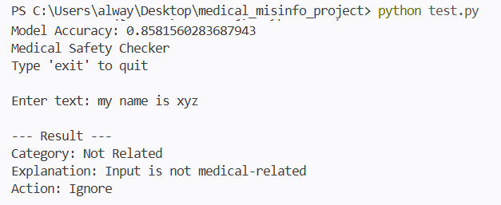

Medical Misinformation Detector

Overview

This project detects whether medical advice is **Real or Fake** using Machine Learning and NLP techniques.

How it Works

* Cleans input text
* Converts text into numerical form using TF-IDF
* Uses Logistic Regression for prediction
* Applies rule-based filtering to detect suspicious phrases

Tech Stack

* Python
* Pandas
* Scikit-learn
* NLP (TF-IDF)

How to Run

python test.py

Use Case

Helps identify misleading or harmful medical advice and improves trust in online health information.

Output Screenshot

